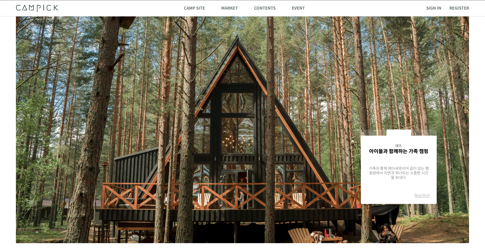

# ⛺️ CAMPICK

> "캠핑(camping)" + "선택하다(pick)" = "캠픽(campick)", 사용자들이 자신이 선택한 캠핑장과 물품 정보를 나누며 즐길 수 있는 캠핑 커뮤니티 웹사이트

### 💡 campick 소개

현대 사회에서 캠핑은 자연을 즐기고 스트레스를 해소하는 활동으로 인기를 끌고 있습니다. <br> 그러나 캠핑 관련 정보를 공유하고 소통할 수 있는 커뮤니티가 부족하여, 캠핑 애호가들 간의 정보 교류와 문화 확산이 제한적입니다. <br>
이러한 문제점을 해결하기 위해 좀 더 편리하게 **_캠핑장 검색, 캠핑 물품 중고거래, 캠핑에 관한 정보 공유_**를 할 수 있는 캠핑 애호가들을 위한 웹사이트 "캠픽(Campick)"을 제작하게 되었습니다.



[Deploy Link] <https://campickv2.netlify.app>

### 👫 팀원

### 🗓️ 개발 기간

### 🛠️ 개발 환경

- Front-end <br>
  
  
  
  
  

- Back-end <br>
  
  
  

- Database <br>
  

- Design <br>
  

- Communication <br>
  
  
  

- Environment <br>
  
  
  

- Config <br>
  

- Deploy <br>
  

### 👩🏻‍💻 페이지별 주요 기능 및 개인 역할

### 💻 구조

```
📦campick-server
┣ 📂constants
┣ 📂controller
┣ 📂models
┣ 📂routes
┣ 📂services
┣ 📂utils
┣ 📜server.js
┗ 📜package.json
```

```
📦campick-client
┣ 📂public
┃ ┣ 📂images
┃ ┃ ┣ 📂ContentsImage
┃ ┃ ┣ 📂ContentsVideo
┃ ┃ ┗ 📂EventImage
┃ ┣ 📜index.html
┃ ┗ 📜favicon.ico
┣ 📂src
┃ ┣ 📂components
┃ ┣ 📂pages
┃ ┣ 📂store
┃ ┣ 📂utils
┃ ┗ 📜App.js
┣ 📜README.md
┣ 📜package.json
┗ 📜.gitignore
```

### 💣 이슈 및 해결
